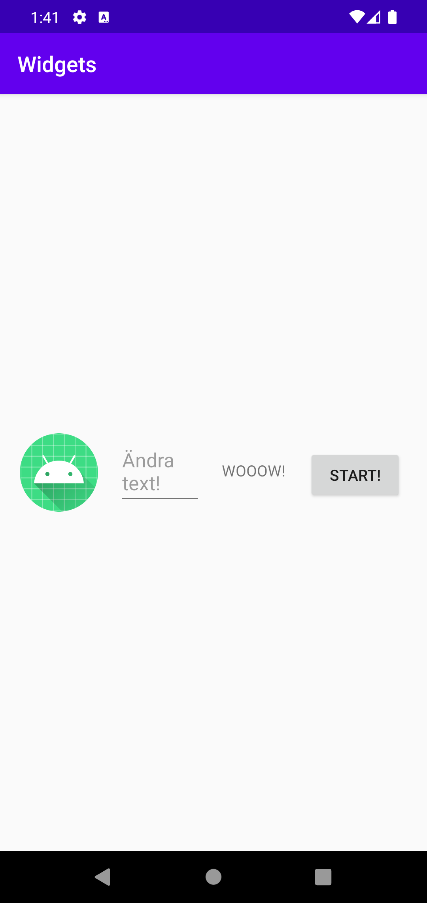

**# Rapport
Denna inlämning gck ut på att anpassa UI-layout och även välja positioneringen av tre olika widgets. 
Första man skulle göra var att välja mellan att lägga till LinearLayout eller ConstraintLayout.
Mitt val var LinearLayout. Så valde även en Horisontell orientering. FÖr att göra så att att LinearLayout är på korrekt plats på 
ConstraintLayout så tog jag hjälp av ConstraintLayout attributer för att säkerhetställa vertikala och horisontella begränsningar mot parent. 

<LinearLayout
android:layout_width="match_parent"
android:layout_height="wrap_content"
android:orientation="horizontal"
android:padding="10dp"
app:layout_constraintTop_toTopOf="parent"
app:layout_constraintBottom_toBottomOf="parent"
app:layout_constraintLeft_toLeftOf="parent"
app:layout_constraintRight_toRightOf="parent">

Därefter las till tre olika widgets, där EditText,ImageView och button las till. Detta lass även till med layout_margin.
Detta gjordes för att få fram mer utrymme mellan dem.

EditText:
<EditText
android:id="@+id/editText"
android:layout_width="0dp"
android:layout_height="wrap_content"
android:hint="Ändra text!"
android:layout_margin="10dp"
android:layout_weight="1"/>

ImageView:
<ImageView
android:id="@+id/imageView"
android:layout_width="wrap_content"
android:layout_height="wrap_content"
android:src="@mipmap/ic_launcher"
android:layout_margin="8dp" />

Button:
<Button
android:id="@+id/button"
android:layout_width="wrap_content"
android:layout_height="wrap_content"
android:text="START!"
android:layout_margin="12dp" />

I slutet så ändrades widgets ordning och detta gjordes med hjälp av layout_weight på editText som gjorde att utrymmet balanserades bättre. 

](android.png)
